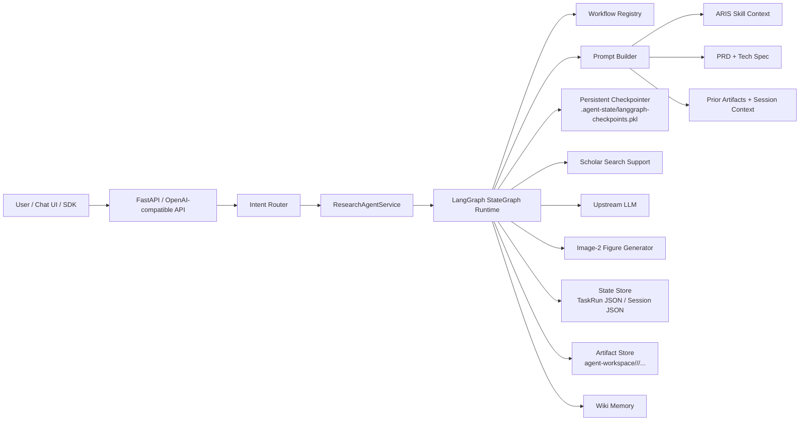
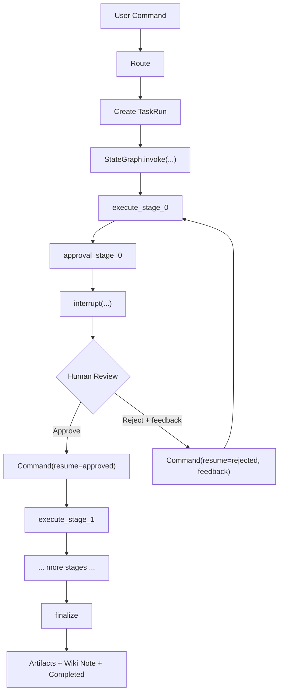

# LangGraph Refactor Architecture
## What Changed

The orchestration layer now runs through a real LangGraph `StateGraph` runtime instead of only using a handwritten stage loop.

External behavior is intentionally preserved:

- `POST /api/agent/chat`
- `POST /api/tasks/{task_id}/approve`
- `POST /api/tasks/{task_id}/reject`
- `POST /v1/chat/completions`
- `POST /v1/responses`
- local `/chat` UI

## Core Runtime

The new runtime lives in:

- `src/research_agent_platform/graphs/runtime.py`
- `src/research_agent_platform/graphs/checkpointer.py`

It introduces:

- a per-workflow `StateGraph`
- explicit stage execution nodes
- explicit approval nodes for approval stages
- `interrupt(...)` for human checkpoints
- `Command(resume=...)` for approval and revision feedback
- a persistent LangGraph checkpointer stored under `.agent-state/langgraph-checkpoints.pkl`

## Execution Model

### 1. Request entry

`ResearchAgentService.chat()` still receives the incoming user message and routes it to either:

- plain chat reply
- workflow start
- workflow resume while waiting for human review

### 2. Routing

`router/intent.py` decides which workflow command to run:

- explicit command
- heuristic route
- LLM classifier fallback

### 3. Task creation

`_start_task()` creates `TaskRun`, assigns the artifact root, writes the initial progress entry, and then delegates to:

- `LangGraphWorkflowRuntime.start_task(...)`

### 4. Graph execution

For each workflow command such as `/idea`, `/write`, or `/present`, the runtime compiles a graph like:

- `START`
- `execute_stage_0`
- optional `approval_stage_0`
- `execute_stage_1`
- optional `approval_stage_1`
- ...
- `finalize`
- `END`

### 5. Stage nodes

Each execution node:

- loads the current `TaskRun`
- updates `current_stage_index` and `current_stage_name`
- gathers support context such as literature search artifacts
- builds the stage prompt from PRD, tech spec, skill excerpts, prior artifacts, and revision feedback
- calls the upstream text model
- writes the generated artifact into `agent-workspace/<user_id>/<session_id>/...`
- appends progress entries

### 6. Approval nodes

For approval stages:

- a checkpoint markdown file is written under `Content/...`
- `TaskRun.status` becomes `waiting_human`
- LangGraph calls `interrupt(...)`
- the graph is paused and checkpointed

When the user approves or rejects:

- `approve_task()` or `reject_task()` calls `LangGraphWorkflowRuntime.resume_task(...)`
- the graph resumes through `Command(resume={approved, feedback})`
- approval moves to the next stage
- rejection loops back to the same execution node with revision feedback

### 7. Finalization

The finalize node still performs workflow-specific post-processing:

- research contract for `/idea`
- generated figure artifacts for `/fig`
- document export and compile artifacts for `/write`
- wiki note recording for all workflows

## State Layers

There are now two state layers:

### Business state

Stored in the existing JSON files:

- `.agent-state/sessions/*.json`
- `.agent-state/tasks/*.json`

These remain the source of truth for:

- session history
- task metadata
- progress log
- approvals
- artifacts

### Graph runtime state

Stored by the LangGraph checkpointer:

- `.agent-state/langgraph-checkpoints.pkl`

This is the source of truth for:

- paused graph position
- resumable interrupt state
- internal node execution continuity

## Compatibility Strategy

The old handwritten resume loop is still retained as a fallback path for tasks that do not have LangGraph checkpoint state, so existing or legacy task records are less likely to break.

## High-Level Flow

1. User sends `/present ...`
2. Router maps it to the presentation workflow
3. `TaskRun` is created
4. LangGraph runs `execute_stage_0`
5. LangGraph hits `approval_stage_0` and interrupts
6. UI shows the checkpoint
7. User approves or sends revision feedback
8. LangGraph resumes
9. Remaining stages execute
10. Finalize node writes exports and wiki note
11. Task status becomes `completed`

## Mermaid Diagrams

### Architecture

### Runtime Flow

