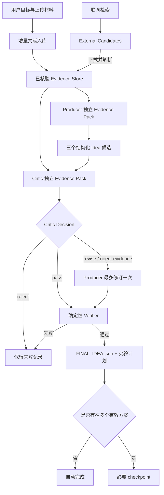

# /plan、/idea 与文献管理借鉴方案

## 1. 目标与约束

本方案只增强现有 Agent 的 `/plan`、`/idea` 和文献管理能力，不改变以下基础框架：

- 保留 `local/<session_id>/` 会话工作区和既有标准目录。
- 保留 LangGraph 工作流、Artifact Store、Wiki、前端和按需 checkpoint 策略。
- 保留当前 Scholar 多源检索与 `/present` 页面生成链路。
- 外部项目只用于能力审计和设计借鉴；集成代码在本项目内按现有风格原生实现。

## 2. 审计范围与结论

### 2.1 SciFlow

本地源码目录：`J:\Desktop\科研agent\SciFlow-main`

已完成源码级审计。该项目的实际定位是 Research OS 的文献工作流底座，包含 119 个源码、文档和测试相关文件，核心链路如下：

1. **研究访谈与准备度门禁**：7 个最小问题、按研究阶段动态追问、15 分制 readiness gate。0–5 分禁止检索，6–9 分只允许探索性检索，10–12 分允许正式检索，13–15 分允许高度定向检索。
2. **检索计划与范围控制**：从 `LiteratureSearchBrief` 推导概念组、自然语言查询、AND/OR 查询、父领域跨界查询和学科范围建议。
3. **文献后处理**：确定性纳排与相关性评分、A/B/C/D 证据分级、结构化字段抽取、覆盖/空白/矛盾综合、引用存在性和主张支撑验证。
4. **文献库生命周期**：DOI/标题/作者去重，`PENDING/DOWNLOADED/MISSING/USER_PROVIDED` 状态，PDF `%PDF` 头校验、pypdf 解析和页数校验，失败文献进入待补清单。
5. **工作交接与审计**：以 `TaskEnvelope/TaskResult` 传递任务，以 `topic.md + summary.md + papers/*.pdf` 交接给后续 Idea 系统，并通过运行账本记录步骤、输入哈希和输出哈希。

对当前 Agent 最有价值的是其中的确定性算法层，不是 Agno、Postgres/pgvector、飞书或大丫头编排外壳。SciFlow 没有独立 `LICENSE`、`COPYING` 或 `NOTICE` 文件，因此不直接复制代码；采用现有项目的数据模型和工作流原生重写。

验证限制：源码包声明约 176 个测试函数，但当前环境缺少 `SQLAlchemy` 等可选依赖，完整测试尚未实际运行。静态代码、测试结构和 README/架构文档已完成审计；集成前应在隔离环境安装 `pyproject.toml` 依赖后重新跑全量测试。

### 2.2 本地交接项目

审计目录：`自动化科研系统-同事交接-2026-07-25/自动化科研系统-同事交接-2026-07-25/项目代码/gnn-research-copilot`

已核验：

- 自动测试：33 项通过。
- 真实运行：8 份文档、284 条页码级证据、788 个节点、1155 条关系。
- Idea 运行：Producer 与 Critic 独立检索，最多修订一次，最终验证通过。
- 可追踪产物：Proposal、Critique、Revision、Final Review、Evidence Pack、模型调用和 Verification 均为独立 JSON。

限制：

- 源码包无 Git 历史和独立许可证文件，不直接复制实现。
- 抽取规则含 GNN 专用关键词与数据集，不适合作为通用科研默认逻辑。
- 8 份材料产生 788 个节点，完整图谱成本较高，不应成为每次 `/idea` 的默认前置步骤。

## 3. 建议纳入的能力

### 3.1 Evidence Contract：最高优先级

为本地文档与已核验论文片段建立统一证据记录：

```json
{
  "evidence_id": "ev_...",
  "source_id": "src_...",
  "relative_path": "paper/uploads/example.pdf",
  "page": 12,
  "text": "原文片段",
  "quote_hash": "sha256:...",
  "origin": "local_document",
  "verification_status": "verified_local"
}
```

核心规则：

- `/idea` 的支持证据、反对证据和实验依据必须引用 `evidence_id`。
- 联网搜索结果先标记为 `external_candidate`，不能直接成为已核验正文证据。
- 只有下载到 `bib/` 或 `paper/` 并完成解析后，候选才升级为 `verified_local`。
- 原始事实、Agent 推断和 Idea 产物分别标记为 `EXTRACTED`、`INFERRED`、`AI_DERIVED`。

### 3.2 Research Brief 与 Idea Contract：最高优先级

借鉴 SciFlow 的 `ResearcherBackground/ResearchTopic/ResearchStageInfo/Blocker/LiteratureTask/SearchScope/PlannedOutput`，在当前 Agent 中增加一个轻量 `ResearchBrief`。它不要求用户填写固定表单，而是从自然语言、上传材料和已有会话上下文中 best-effort 装配；只有影响检索结果的字段缺失时才追问。

建议字段：

- `discipline`
- `research_topic`
- `research_object`
- `research_stage`
- `core_difficulty`
- `decision_to_make`
- `output_mode`
- `time_range`
- `data_or_population`
- `constraints`
- `evidence_needed`

在 Brief 之上建立结构化 Idea 合同：

把当前 Markdown Idea 报告补充为结构化合同：

- `research_question`
- `hypothesis`
- `novelty_claim`，禁止未经验证的“首次/首个”表述
- `evidence_for[]`
- `evidence_against[]`
- `nearest_precedents[]`
- `success_condition`
- `failure_condition`
- `alternative_explanations[]`
- `required_resources[]`
- `risks[]`
- `scores`：novelty、evidence、falsifiability、feasibility、risk

保留当前 `idea/IDEA_REPORT.md`，新增机器可读的 `idea/IDEA_CANDIDATES.json` 和 `idea/FINAL_IDEA.json`。

### 3.3 Producer/Critic 独立检索：高优先级

当前 `/idea` 的不同阶段共享 `bib/LITERATURE_SEARCH.md`。建议改为：

1. Producer 根据研究目标、研究空白和已有材料构建 Evidence Pack。
2. Critic 使用独立检索查询，优先寻找最近前例、约束条件、反例和资源不可行点。
3. 两者只通过结构化 Proposal/Critique 交换，不共享不可追踪的自由文本上下文。
4. Critic 只能提出 `pass | revise | need_evidence | reject`，不能直接改写 Proposal。
5. 最多自动修订一次；只有多个合理方案需要用户选择时才触发 checkpoint。

SciFlow 的检索轨道设计也值得采用：`core` 表示用户问题的直接相关文献，`parent` 表示父领域或跨界启发文献。两类文献在报告、排序和 `/present` 来源追踪中分开显示，避免跨界启发被误认为直接前例。

### 3.4 Idea Verifier：高优先级

在 `/idea` 完成前增加确定性校验，不再依赖模型自我声明：

- 所有引用的 Evidence ID 必须存在。
- 支持证据与反对证据不得重叠。
- Producer 与 Critic 的 retrieval trace 必须不同。
- 成功与失败条件必须使用相同的数据、范围和评价协议。
- 实验计划必须引用证据并包含基线、变量、指标、对照和预算。
- Critic 未通过时不得把 Idea 标记为 verified。

输出 `Content/idea-runs/<run_id>/VERIFICATION.json`。

### 3.5 增量文献库：中高优先级

在每个会话工作区中增加轻量 SQLite 索引，不改变标准目录：

```text
bib/
  library.sqlite
  library.json
  references.bib
  papers/
Content/
  literature-traces/
  evidence-packs/
```

第一版只实现：

- PDF、Word、Markdown、BibTeX、RIS 的元数据与文本解析。
- SHA256 增量入库，重复运行跳过未变化文件。
- 删除材料时软删除当前索引但保留历史 trace。
- DOI、arXiv ID、规范化标题三级去重。
- BibTeX 导出和引用键稳定化。
- 页码级 Evidence Pack 检索与检索日志。

从 SciFlow 借鉴的下载状态和文件安全规则应直接纳入：任何自动下载结果先执行文件头、PDF 解析和页数校验；失败进入 `MISSING`，用户可以通过拖拽或上传接口补传，不能把错误页或损坏文件传给 `/idea`。

暂不默认实现大规模图数据库或向量数据库；SQLite + FTS/BM25 足以覆盖第一阶段。

### 3.6 可选知识图谱：中优先级，Deep 模式

图谱不作为默认 `/idea` 前置条件，只在以下场景启用：

- 用户显式要求系统综述、研究脉络、冲突关系或多论文机制比较。
- 本地文献数量达到阈值，简单 Evidence Pack 已不足以解释关系。
- 用户选择 `deep` 模式。

建议节点只保留 Paper、Problem、Method、Dataset、Metric、Claim、Limitation、Idea；Evidence 作为引用记录，不同时复制为大量图节点。这样避免 8 篇论文扩张到近 800 个节点。

## 4. `/plan` 的增强路线

SciFlow 没有一个可直接复用的自动规划器，但其 Brief、概念组、检索计划、任务封装和运行账本可以作为 `/plan` 的基础数据契约。规划算法仍由当前 Agent 的 LangGraph 工作流负责。

现有两个阶段保持名称和 Markdown 产物不变，在旁路增加结构化合同：

### Research Blueprint

新增：

- `research_question`
- `assumptions[]`
- `evidence_constraints[]`
- `milestones[]`：输入、输出、依赖、完成条件
- `decision_points[]`：只有真正需要用户选择的方案
- `risks[]`：触发条件、缓解措施、降级路径

输出 `plan/RESEARCH_BLUEPRINT.json`。

### Execution Checklist

新增：

- Task DAG，而不是只有线性清单。
- 每个任务的 `depends_on`、`required_artifacts`、`acceptance_criteria`、`estimated_cost`。
- 成功条件、失败条件、停止条件和重试预算。
- 与 `/idea` 的 `FINAL_IDEA.json`、`plan/EXPERIMENT_PLAN.md` 建立显式引用。

输出 `plan/EXECUTION_CHECKLIST.json`。

预留 `PlanningAdapter` 接口；未来如果获得 SciFlow 上游更新或明确许可证，再评估是否吸收其 DAG 分解、资源调度或计划修订实现。当前不引入 Agno、Postgres/pgvector 或其外部 Orchestrator。

## 5. `/idea` 的目标流程



## 6. 目录映射

不新增顶层目录：

| 能力 | 产物位置 |
|---|---|
| 文献原件与引用库 | `bib/` |
| Evidence Pack、检索与验证轨迹 | `Content/literature-traces/`、`Content/evidence-packs/` |
| 候选 Idea、最终 Idea、演化记录 | `idea/` |
| 最终 Proposal、实验计划、执行 DAG | `plan/` |
| 面向用户的知识页面 | `wiki/` |
| 运行诊断 | `logs/` |

## 7. 分阶段实施

### Phase 0：SciFlow 补充审计

- 已获得源码压缩包目录并完成静态审计。
- 待在隔离环境安装 SciFlow 依赖后跑全量测试。
- 由于没有独立许可证文件，不复制代码，只按现有项目重写可借鉴的数据契约。
- 只更新 `PlanningAdapter` 决策，不阻塞后续阶段。

### Phase 1：证据与 Idea 合同

- 增加 Evidence、Proposal、Critique、Verification 的 Pydantic 模型。
- 从本地 PDF/Word/Markdown 建立页码级证据。
- `/idea` 输出结构化候选与最终 Idea。
- 增加确定性 Verifier 和单元测试。

验收：任何最终 Idea 都能追到原文件和页码；无效 Evidence ID 会阻断完成。

### Phase 2：双 Agent Idea 闭环

- Producer/Critic 使用不同查询和独立 trace。
- 支持一次自动修订。
- checkpoint 仅用于多个有效方案的人工选择。
- 将演化记录写入 `idea/IDEA_EVOLUTION.jsonl` 和 Wiki。

验收：首次通过最多两次模型调用；修订路径最多四次；Critic 不得直接修改 Proposal。

### Phase 3：增量文献库

- 建立 `bib/library.sqlite`、去重、软删除、BibTeX/RIS 导入导出。
- Scholar 搜索结果进入 candidate 区，下载解析后升级状态。
- 为 `/idea`、`/plan`、`/write` 提供统一 Literature Service。

验收：相同文件重复扫描不产生重复记录；引用键稳定；外部候选不能作为 verified evidence。

### Phase 4：增强 `/plan`

- 从 Final Idea 生成 Blueprint JSON 与 Execution DAG。
- 增加依赖、资源、停止条件和验收标准。
- 支持计划修订但不引入例行 checkpoint。

验收：每个计划任务都有输入、输出、依赖和完成判定；实验任务与 Idea 证据链一致。

### Phase 5：可选 Deep Knowledge 模式

- 实现精简关系图与冲突路径。
- 默认关闭，只对系统综述和复杂多论文任务启用。
- 设节点、边和 Evidence Pack 上限，防止上下文膨胀。

## 8. 明确不直接纳入的部分

- 不直接复制无许可证项目源码。
- 不引入 GNN 专用关键词、固定数据集或领域默认实验模板。
- 不把八角色委员会设为默认；Producer/Critic 两角色足够覆盖主要质量收益。
- 不让联网摘要直接成为论文事实。
- 不默认生成全量知识图谱。
- 不增加新的顶层工作区目录。
- 不恢复例行审批；只有真实方案选择才 checkpoint。

## 9. 建议优先级

建议立即实施 Phase 1 和 Phase 2。这两阶段对 `/idea` 的可信度提升最大，改动集中，且不依赖 SciFlow。Phase 3 随后统一文献生命周期。`/plan` 的 Phase 4 在结构化 Final Idea 稳定后接入，避免计划建立在不可追踪的自由文本之上。
