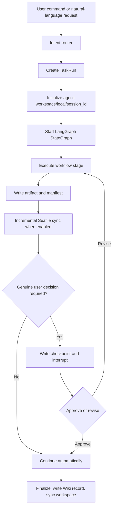
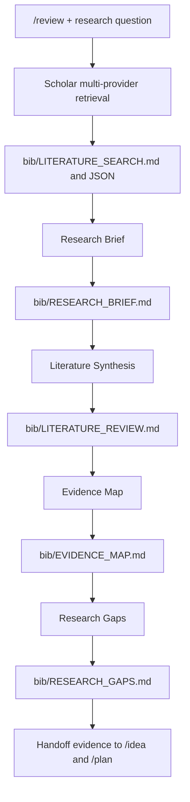
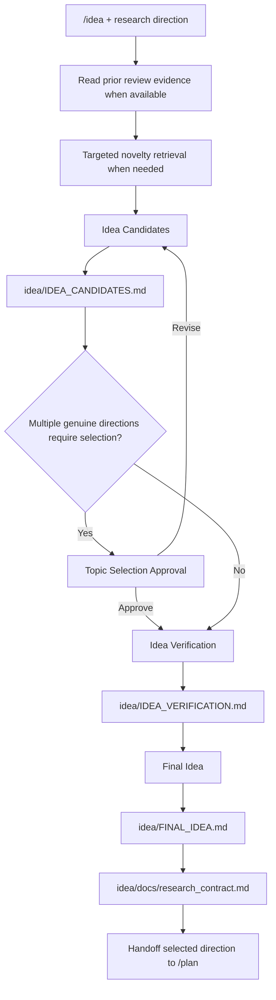
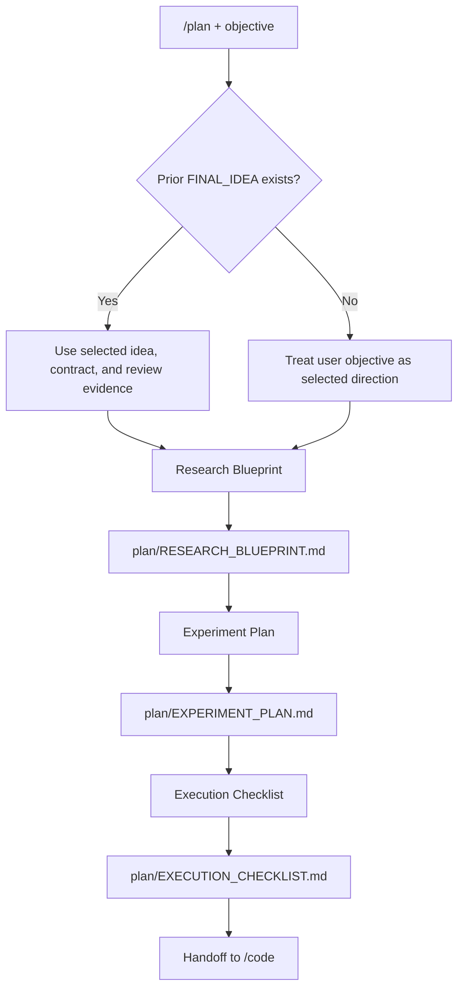
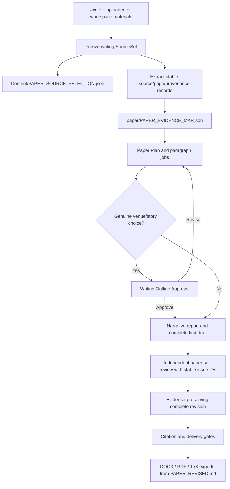
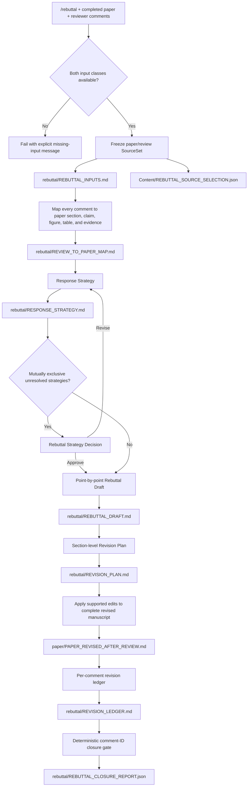
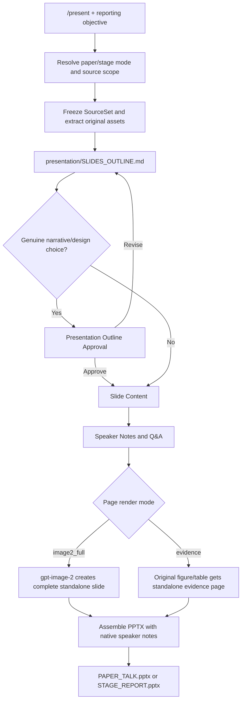
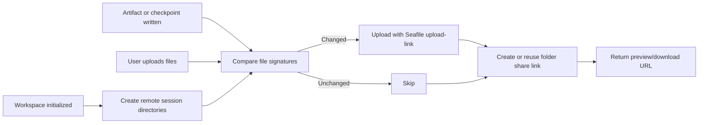

# Research command flows

This document describes the current command boundaries and implementation paths. `/review`, `/idea`, and `/plan` can run independently, but they form a natural evidence-to-execution handoff when used in one session.

## Shared runtime

The local UI uses `user_id=local`. Cloud sync mirrors the same boundary to `SEAFILE_REMOTE_ROOT/local/<session_id>/` and exposes folder preview/download links through `cloud_workspace` in API responses.

## `/review`: literature evidence

`/review` means literature review. It searches OpenAlex, Semantic Scholar, and arXiv by default; Web of Science and CNKI are enabled by configuration. It does not process peer-review comments.

## `/idea`: candidate selection

`/idea` generates and validates directions. It may perform a targeted novelty search, but it does not write an experiment plan.

## `/plan`: experiment and execution design

`/plan` owns hypotheses, claim-to-evidence requirements, datasets, baselines, metrics, ablations, sanity checks, resources, launch order, stop conditions, milestones, and the execution checklist.

## `/write`: evidence-grounded paper production

The deterministic gates validate source presence, required sections, citation-key resolution, evidence-ID resolution, placeholders, and compile status. They do not claim that citations semantically support each sentence; author verification remains required.

## `/rebuttal`: peer-review response

`/rebuttal` does not search for literature and does not infer a manuscript from the objective. Input priority is explicit `--paper`/`--review` paths, then the latest matching upload batch, then the newest final-paper material under `paper/` and review material under `rebuttal/uploads/`. The SourceSet is frozen at task start. A checkpoint appears only when evidence cannot resolve two or more genuinely mutually exclusive response strategies. `/auto-review-loop` and `/review-response` route to `/rebuttal` for compatibility.

## `/present`: deck production

Image-2 pages and original-evidence pages remain separate. Original figures and tables are never overlaid on Image-2 narrative pages.

## Cloud lifecycle

Cloud sync failures are recorded in `ChatSession.cloud_workspace.error` and the task progress log. They do not fail the research workflow.

For Tsinghua Seafile, the local configuration tool exchanges a hidden password prompt for an API token and stores only the token in `.env`. The `/chat` sync icon or `POST /api/sessions/{session_id}/sync` then uploads the current session and refreshes its folder share links.
