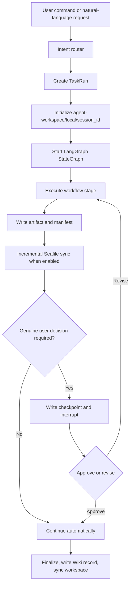
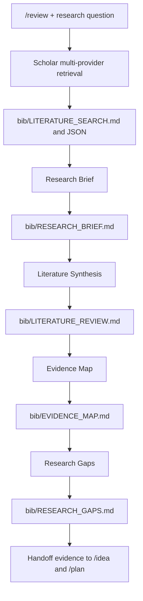
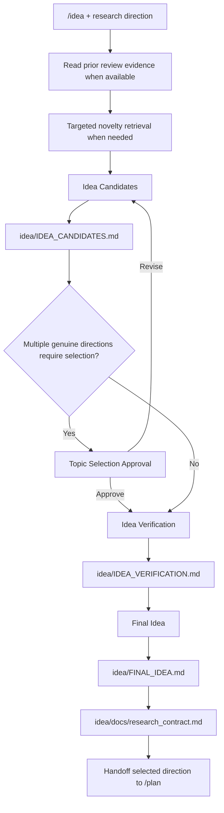
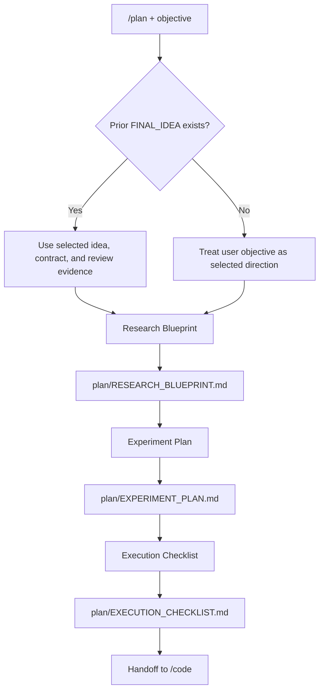
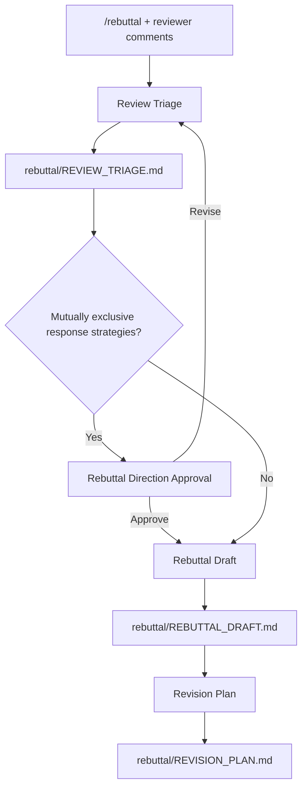
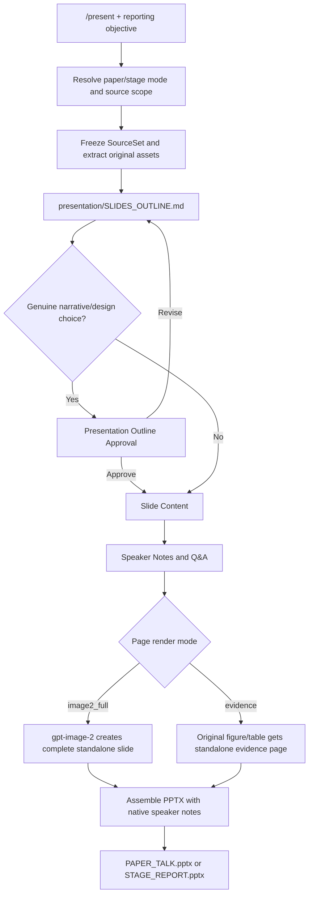
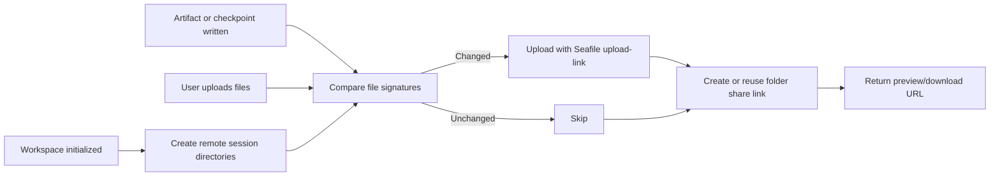

# Research command flows

This document describes the current command boundaries and implementation paths. `/review`, `/idea`, and `/plan` can run independently, but they form a natural evidence-to-execution handoff when used in one session.

## Shared runtime

The local UI uses `user_id=local`. Cloud sync mirrors the same boundary to `SEAFILE_REMOTE_ROOT/local/<session_id>/` and exposes folder preview/download links through `cloud_workspace` in API responses.

## `/review`: literature evidence

`/review` means literature review. It searches OpenAlex, Semantic Scholar, and arXiv by default; Web of Science and CNKI are enabled by configuration. It does not process peer-review comments.

## `/idea`: candidate selection

`/idea` generates and validates directions. It may perform a targeted novelty search, but it does not write an experiment plan.

## `/plan`: experiment and execution design

`/plan` owns hypotheses, claim-to-evidence requirements, datasets, baselines, metrics, ablations, sanity checks, resources, launch order, stop conditions, milestones, and the execution checklist.

## `/rebuttal`: peer-review response

The former peer-review behavior of `/review` now belongs to `/rebuttal`. `/auto-review-loop` and `/review-response` route to `/rebuttal` for compatibility.

## `/present`: deck production

Image-2 pages and original-evidence pages remain separate. Original figures and tables are never overlaid on Image-2 narrative pages.

## Cloud lifecycle

Cloud sync failures are recorded in `ChatSession.cloud_workspace.error` and the task progress log. They do not fail the research workflow.
